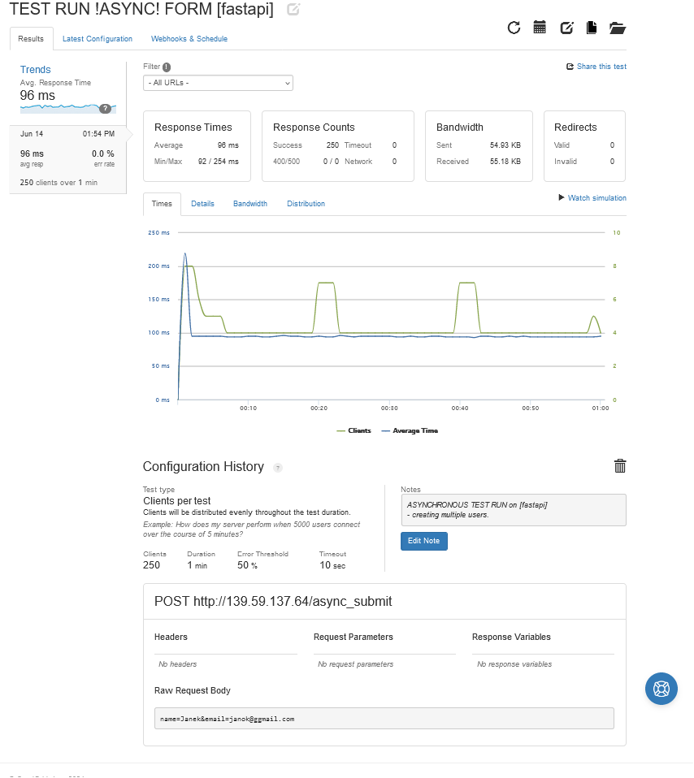
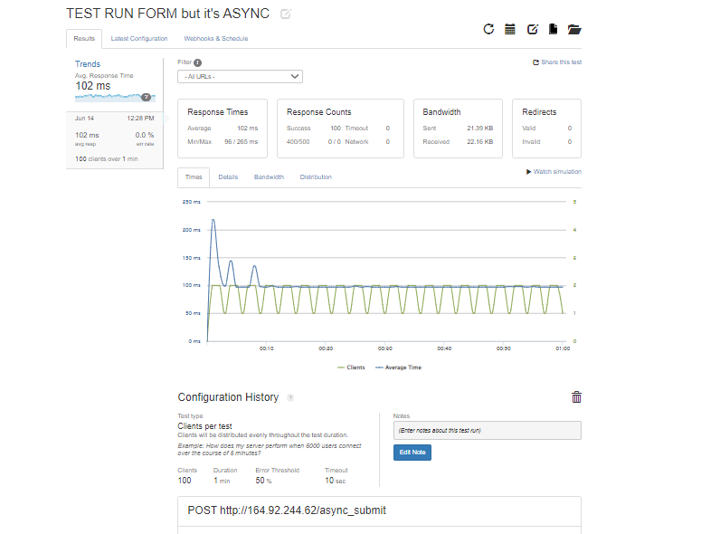
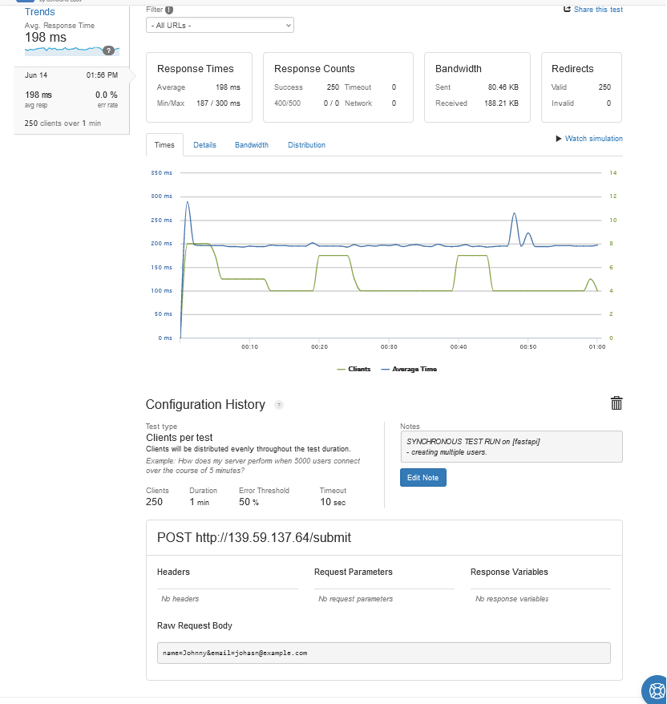
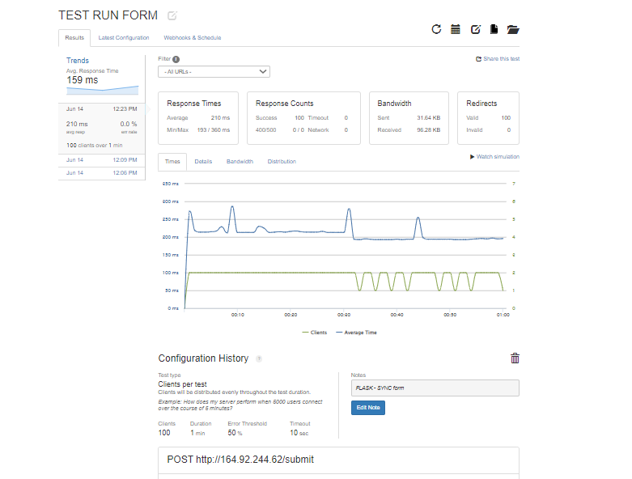

# python_services_recru

## Features

- Synchronous form submission with SQLite database
- Asynchronous form submission with Celery and Redis
- Systemd service for managing the application

## IP Addresses

- Asynchronous form submission *fastapi*: [http://139.59.137.64/async](http://139.59.137.64/async)
- Standard form submission *fastapi*: [http://139.59.137.64](http://139.59.137.64)

- Asynchronous form submission *Flask*: [http://164.92.244.62/async](http://164.92.244.62/aync)
- Main application standard form *flask*: [http://164.92.244.62](http://164.92.244.62)

## Screenshots

Here are some screenshots of the application:

### Screenshot 1

### Screenshot 2

### Screenshot 3

### Screenshot 4

## Setup Instructions

### Prerequisites

- Python 3.7+
- Redis
- SQLite
- Celery

### TEST LINKS:
https://bit.ly/3KLMfBX
https://bit.ly/3xjFdBg
https://bit.ly/3RrhC8s
https://bit.ly/45nBNdg
